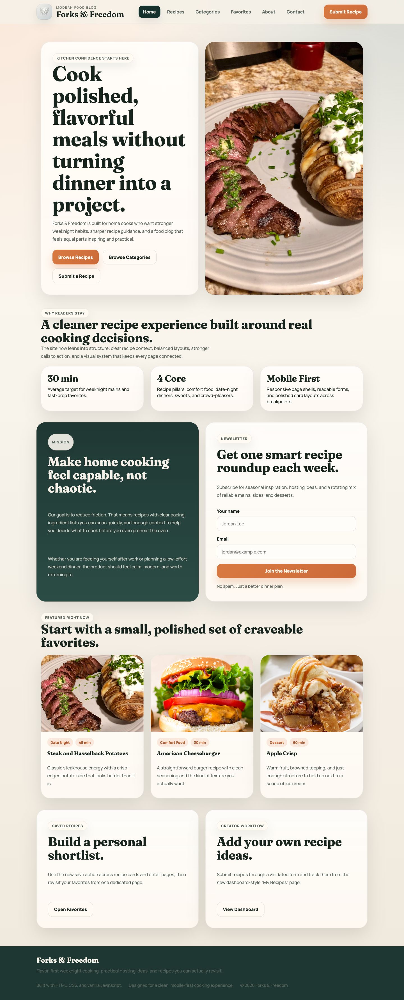
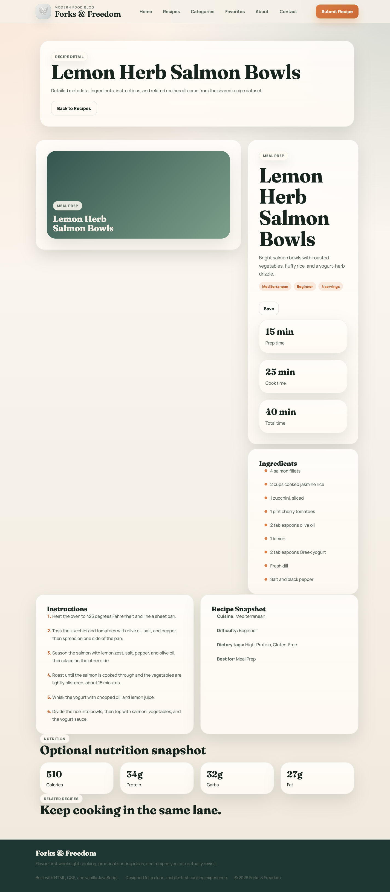
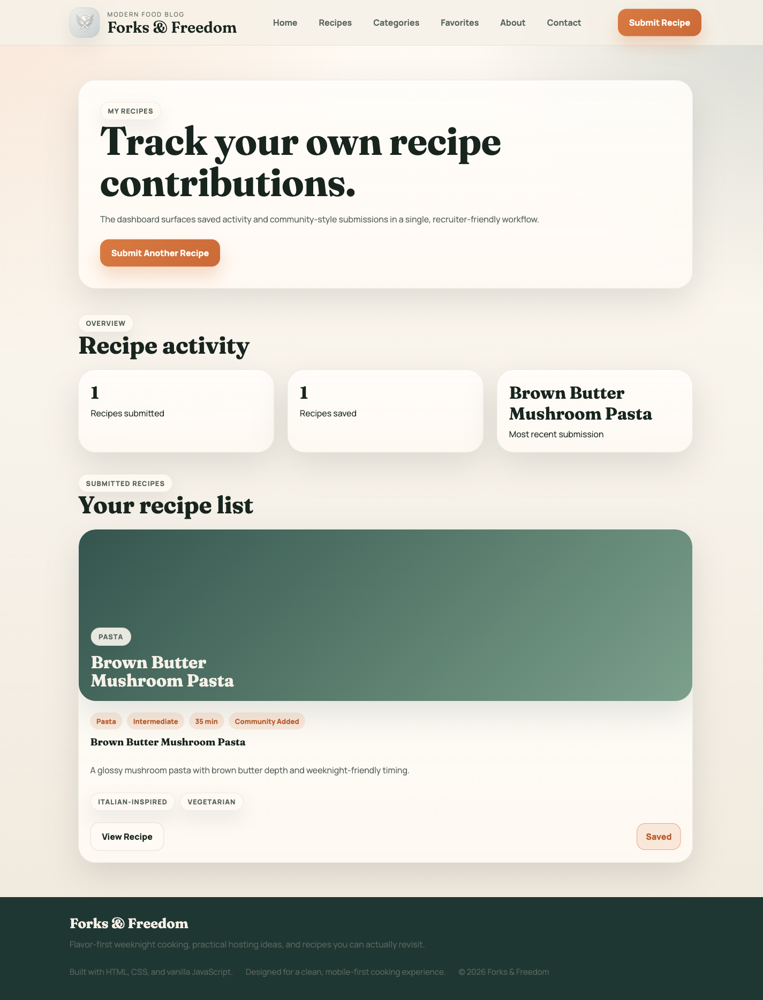

# Forks & Freedom

Forks & Freedom is a polished multi-page food blog built with HTML, CSS, and vanilla JavaScript. The project was upgraded from a basic static course site into a portfolio-quality product with a consistent design system, richer recipe data, improved recipe discovery, saved recipes, local recipe submission, a dashboard workflow, and a cleaner content architecture.

## Project Overview

The site is designed to feel like a modern food and lifestyle product rather than a collection of disconnected static pages. The current version focuses on:

- A reusable shared shell with a consistent navbar, footer, typography, spacing, cards, and form styling
- A richer recipe model with metadata, nutrition, dietary tags, and reusable detail rendering
- Practical product flows such as favorites, search, categories, and local recipe submission
- Cleaner maintainability through shared JavaScript data/rendering and removal of unused legacy assets

## Screenshots

### Home


### Recipes


### Recipe Detail


### My Recipes Dashboard


## Key Features

- Modern responsive UI with a single global design system
- Structured recipe library with cuisine, difficulty, prep time, cook time, servings, and dietary tags
- Search, category filtering, dietary tag filtering, and sorting on the recipes page
- Featured, popular, and recent recipe sections
- Dynamic recipe detail page with ingredients, instructions, nutrition, and related recipes
- Favorites flow backed by `localStorage`
- Recipe submission form with validation and local persistence
- Dashboard page for viewing submitted recipes and saved activity
- Categories page, search page, favorites page, and custom `404.html`
- Legacy recipe URLs preserved through redirects to the new shared detail route

## Tech Stack

- HTML5
- CSS3
- Vanilla JavaScript
- `localStorage` for saved recipes and submitted recipe persistence
- Playwright for screenshot capture during the upgrade workflow

## Project Structure

```text
Comp126/
├── index.html
├── recipes.html
├── recipe.html
├── categories.html
├── favorites.html
├── submit.html
├── dashboard.html
├── search.html
├── 404.html
├── javascript/
│   ├── site.js
│   ├── recipe-data.js
│   └── recipes-app.js
├── styles/
│   └── site.css
├── Photos/
└── docs/
    ├── upgrade-audit-plan.md
    └── assets/images/
```

## Running Locally

No package install or build step is required.

### Option 1: Python static server

```bash
python3 -m http.server 4173
```

Then open:

```text
http://127.0.0.1:4173/index.html
```

### Option 2: VS Code Live Server

Serve the repository root and open `index.html`.

## Environment Variables

No environment variables are required for the current version of the project.

## Build And Deployment

This project is a static site, so deployment is straightforward:

1. Push the repository to GitHub.
2. Enable GitHub Pages from the repository settings.
3. Set the published branch to the branch that contains the site files.
4. Use the repository root as the publish source if deploying directly from this structure.

Because the app uses only static assets and client-side JavaScript, there is no backend deployment step in the current implementation.

## Product Pages

- `index.html`: landing page with featured content and product entry points
- `recipes.html`: search, filters, sorting, featured/popular/recent sections
- `recipe.html`: shared recipe detail route powered by query params
- `categories.html`: browse by category
- `favorites.html`: saved recipe collection
- `submit.html`: recipe submission form
- `dashboard.html`: local “My Recipes” dashboard
- `search.html`: dedicated search results page
- `about.html`: team and project context
- `contact.html`: contact information and message form
- `404.html`: custom not found page

## Notes On Persistence

Saved recipes and submitted recipes are stored in the browser with `localStorage`. That means:

- Favorites persist across page refreshes in the same browser
- Submitted recipes show up in the browse, search, favorites, and dashboard flows locally
- Clearing browser storage will reset that state

## Future Improvements

- Add a real backend and database for persistent user accounts and recipe submissions
- Introduce image upload support for submitted recipes
- Add pagination and richer analytics for popular recipe trends
- Improve form feedback with inline validation states and success toasts
- Add automated tests for filtering, search, favorites, and submission flows

## Upgrade Summary

This repository originally contained duplicated page-level styling, hardcoded recipe pages, minimal documentation, and layout issues that created an inconsistent browsing experience. The upgraded version consolidates styling and rendering patterns, fixes overflow problems, expands recipe functionality, and presents the project as a much stronger frontend engineering portfolio piece.
